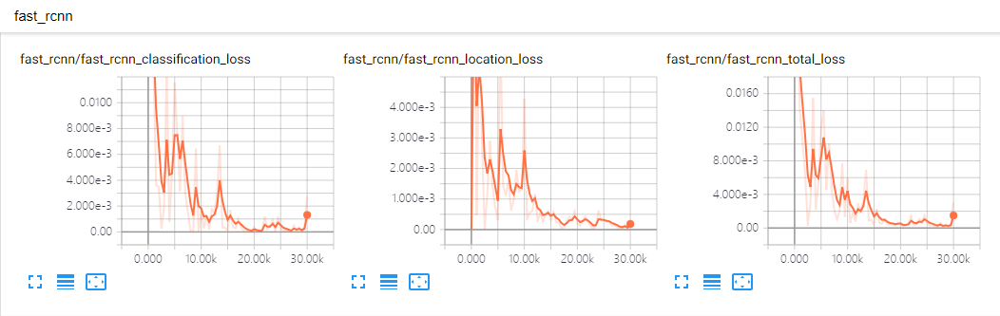
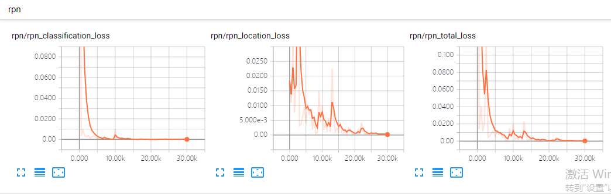
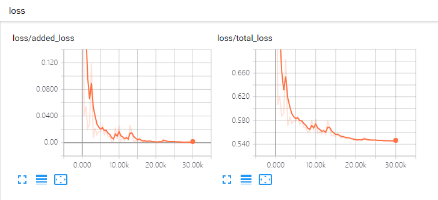
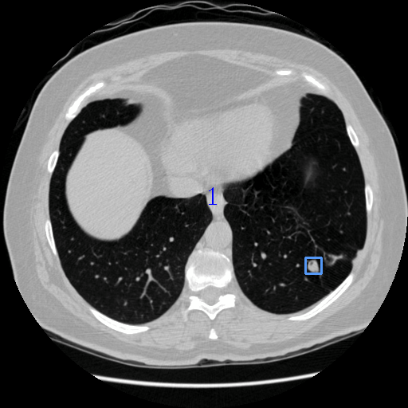
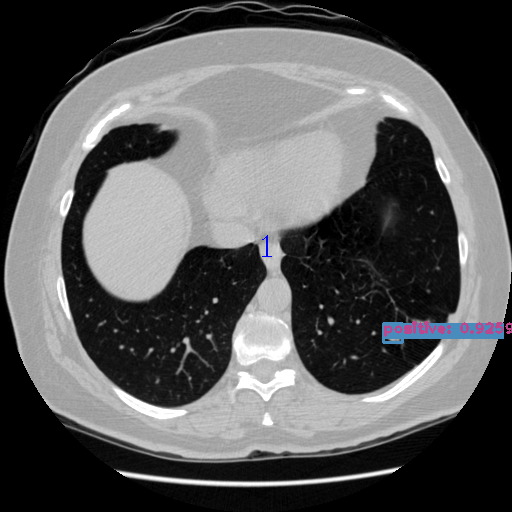

# Feature Pyramid Networks for Pulmonary Nodules Detection        

## Configuration Environment
this project can be trained on [Google Colab](https://colab.research.google.com/notebooks/welcome.ipynb#recent=true),while you should turn your VPN on.     

## Installation    
  Clone the repository    
  ```Shell    
  git clone https://github.com/Andyato/Pulmonary-Nodule-Detection    
  ```       

## Make tfrecord   
The data is VOC format     
```
├── VOCdevkit
│   ├── VOCdevkit_train
│       ├── Annotation
│       ├── JPEGImages
│    ├── VOCdevkit_test
│       ├── Annotation
│       ├── JPEGImages
```     

  ```Shell    
  cd $ROOT/data/io/  
  python convert_data_to_tfrecord.py --VOC_dir='***/VOCdevkit/VOCdevkit_train/' --save_name='train' --img_format='.jpg' --dataset='nodules'
  ```

  
## Train
1、Modify $ROOT/libs/lable_name_dict/***_dict.py, corresponding to the number of categories in the configuration file    
2、download pretrain weight([resnet_v1_101_2016_08_28.tar.gz](http://download.tensorflow.org/models/resnet_v1_101_2016_08_28.tar.gz) or [resnet_v1_50_2016_08_28.tar.gz](http://download.tensorflow.org/models/resnet_v1_50_2016_08_28.tar.gz)) from [here](https://github.com/yangxue0827/models/tree/master/slim), then extract to folder $ROOT/data/pretrained_weights    
3、    
  ```Shell    
  cd $ROOT/tools
  python train.py 
  ``` 

## Test tfrecord     
  ```Shell    
  cd $ROOT/tools    
  python test.py  
  ``` 

## eval  
  ```Shell    
  cd $FPN_ROOT/tools   
  python eval.py --weights (your trained weights directory path) --image_num (eval images number)
  ```  

## Summary   
  ```Shell    
  tensorboard --logdir=$ROOT/output/res**_summary/
  ```    

   
   
   

## Test results    
   

   
